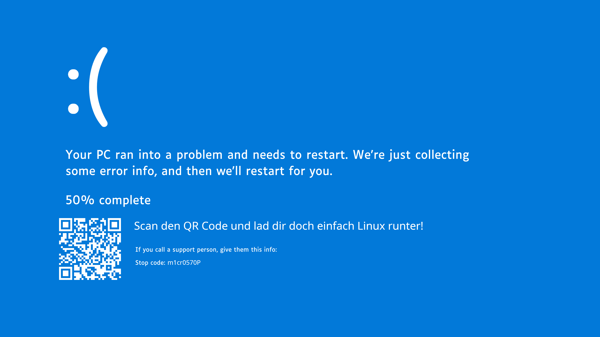

# WindowsToLinux

**Wechseln Sie zu Linux Mint, ohne zu raten.** WindowsToLinux analysiert Ihren Windows-PC und erstellt einen persönlichen PDF-Bericht: Welche Programme laufen unter Linux? Wie gut wird Ihre Hardware unterstützt? Mit konkreten Installationsbefehlen zum Kopieren.



---

## Download

**[Aktuelle Version herunterladen (WindowsToLinux.exe)](../../releases/latest)**

Die EXE-Datei einfach herunterladen und starten, keine Installation nötig.

> **Hinweis zu Windows Defender / SmartScreen:** Windows zeigt beim ersten Start eine Warnung ("Unbekannter Herausgeber"). Das ist bei selbst erstellten EXE-Dateien normal und kein Zeichen für einen Virus. Klicken Sie auf "Weitere Informationen" und dann "Trotzdem ausführen".

---

## Hintergrund

Dieses Projekt entstand im Rahmen eines Universitätsprojekts, aus Frust mit Windows und aus Liebe zu Open Source. Der Gedanke dahinter: Der Wechsel zu Linux scheitert oft nicht am Willen, sondern daran, dass man nicht weiß, was einen erwartet. WindowsToLinux soll diese Unsicherheit nehmen.

---

## Was macht die App?

WindowsToLinux scannt Ihren Computer (dauert in der Regel 1 bis 2 Minuten, bei vielen installierten Programmen auch länger) und erstellt einen PDF-Bericht mit drei Teilen:

**Hardware-Check:** Ist Ihr PC fit für Linux Mint? CPU, RAM, Festplatte, Grafikkarte und WLAN-Chip werden bewertet. Sie erfahren auch, welche Taste Sie beim Einschalten drücken müssen, um von einem USB-Stick zu starten.

**Programm-Check:** Alle Ihre installierten Programme werden in drei Kategorien eingeteilt:

- **Grün:** Direkt unter Linux verfügbar (z.B. Firefox, VLC, LibreOffice)
- **Gelb:** Gute Alternative vorhanden (z.B. GIMP statt Photoshop)
- **Rot:** Kein Linux-Äquivalent bekannt

**Installations-Befehl:** Ein einziger Befehl, mit dem Sie nach der Linux-Installation alle verfügbaren Programme auf einmal installieren.

---

## So funktioniert's

**Schritt 1:** WindowsToLinux.exe herunterladen und starten.

**Schritt 2:** Auf "Analyse starten" klicken und ein bis zwei Minuten warten.

**Schritt 3:** PDF-Bericht speichern und in Ruhe lesen.

---

## Systemvoraussetzungen

- Windows 10 oder Windows 11 (64-Bit)
- Internetverbindung (für die Programm-Analyse)
- Ca. 150 MB freier Speicherplatz für die EXE

Es werden keine persönlichen Daten und keine Hardware-Identifikatoren übertragen. Die App fragt nur Programmnamen bei den öffentlichen APIs Repology und Flathub ab, um Linux-Pendants zu finden.

---

## Ziel: Linux Mint 22 Cinnamon

Der Bericht ist auf **Linux Mint 22 Cinnamon** zugeschnitten, eine der beliebtesten Linux-Distributionen für Windows-Umsteiger. Die offizielle Installationsanleitung finden Sie unter [linuxmint.com/documentation.php](https://www.linuxmint.com/documentation.php).

---

## Häufige Fragen

**Die Analyse dauert sehr lange. Was tun?**

Bei vielen installierten Programmen kann die Online-Abfrage 5 bis 10 Minuten dauern. Das liegt an der Rate-Limitierung der genutzten APIs. Einfach warten.

**Werden meine Daten gespeichert oder hochgeladen?**

Nein. Die App fragt nur öffentliche APIs (Repology, Flathub) mit Paketnamen ab, keine persönlichen Daten. Alle Ergebnisse bleiben lokal auf Ihrem PC.

**Mein Programm fehlt im Bericht oder ist falsch eingestuft.**

Bitte ein [Issue erstellen](../../issues) mit dem Programmnamen. Die Datenbank wird regelmäßig erweitert.

---

## Für Entwickler

Das Projekt ist in fünf Module gegliedert: scanner (lokale Windows-Abfragen), resolver (externe APIs), matcher (Klassifikationslogik), output (HTML- und PDF-Report) und gui (CustomTkinter-Oberfläche).

```bash
# Voraussetzungen: Python 3.12, MSYS2 mit GTK3 (Windows)
git clone <repo-url>
cd windowstolinux-project
pip install -e ".[dev]"

# Demo-Bericht generieren (kein Windows erforderlich)
python demo.py

# Tests ausführen
pytest

# EXE bauen (nur auf Windows, GTK3 muss im PATH sein)
pyinstaller windowstolinux.spec --clean --noconfirm
```

Die EXE wird automatisch per GitHub Actions gebaut, wenn ein Tag `v*` gepusht wird:

```bash
git tag v1.0.0
git push origin v1.0.0
```

Danach erscheint die fertige EXE unter [Releases](../../releases).

---

## Lizenz

MIT (siehe [LICENSE](LICENSE))

---

*Läuft auf Windows 10/11. Analysiert den Umstieg auf Linux Mint 22 Cinnamon.*